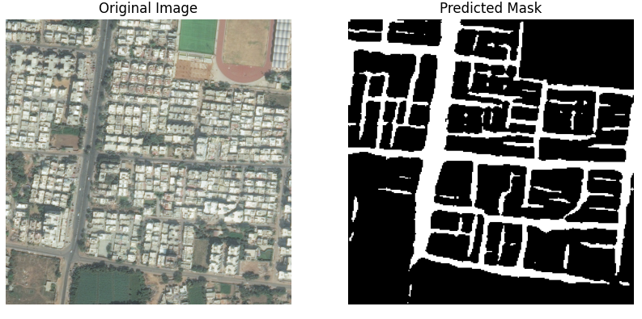

# Road Extraction from Satellite Images  
Useful for urban planning, map updating, and infrastructure analysis. Employs image processing and machine learning to detect and map roads from high-resolution satellite data.

## 📋 Results
<p align="center">
  
</p>
<p align="center">
  
</p>
<p align="center">
  
</p>
<p align="center">
  
</p>
<p align="center">
  
</p>

## 🧠 About Model
```
----------------------------------------------------------------
        Layer (type)               Output Shape         Param #
================================================================
            Conv2d-1         [-1, 16, 256, 256]             448
       BatchNorm2d-2         [-1, 16, 256, 256]              32
            Conv2d-3         [-1, 16, 256, 256]           2,320
       BatchNorm2d-4         [-1, 16, 256, 256]              32
           Dropout-5         [-1, 16, 256, 256]               0
         MaxPool2d-6         [-1, 16, 128, 128]               0
            Conv2d-7         [-1, 32, 128, 128]           4,640
       BatchNorm2d-8         [-1, 32, 128, 128]              64
            Conv2d-9         [-1, 32, 128, 128]           9,248
      BatchNorm2d-10         [-1, 32, 128, 128]              64
          Dropout-11         [-1, 32, 128, 128]               0
        MaxPool2d-12           [-1, 32, 64, 64]               0
           Conv2d-13           [-1, 48, 64, 64]          13,872
      BatchNorm2d-14           [-1, 48, 64, 64]              96
           Conv2d-15           [-1, 48, 64, 64]          20,784
      BatchNorm2d-16           [-1, 48, 64, 64]              96
          Dropout-17           [-1, 48, 64, 64]               0
        MaxPool2d-18           [-1, 48, 32, 32]               0
           Conv2d-19           [-1, 64, 32, 32]          27,712
      BatchNorm2d-20           [-1, 64, 32, 32]             128
           Conv2d-21           [-1, 64, 32, 32]          36,928
      BatchNorm2d-22           [-1, 64, 32, 32]             128
          Dropout-23           [-1, 64, 32, 32]               0
        MaxPool2d-24           [-1, 64, 16, 16]               0
           Conv2d-25          [-1, 128, 16, 16]          73,856
      BatchNorm2d-26          [-1, 128, 16, 16]             256
           Conv2d-27          [-1, 128, 16, 16]         147,584
      BatchNorm2d-28          [-1, 128, 16, 16]             256
          Dropout-29          [-1, 128, 16, 16]               0
  ConvTranspose2d-30           [-1, 64, 32, 32]          32,832
           Conv2d-31           [-1, 64, 32, 32]          73,792
      BatchNorm2d-32           [-1, 64, 32, 32]             128
          Dropout-33           [-1, 64, 32, 32]               0
           Conv2d-34           [-1, 64, 32, 32]          36,928
      BatchNorm2d-35           [-1, 64, 32, 32]             128
          Dropout-36           [-1, 64, 32, 32]               0
  ConvTranspose2d-37           [-1, 48, 64, 64]          12,336
           Conv2d-38           [-1, 48, 64, 64]          41,520
      BatchNorm2d-39           [-1, 48, 64, 64]              96
          Dropout-40           [-1, 48, 64, 64]               0
           Conv2d-41           [-1, 48, 64, 64]          20,784
      BatchNorm2d-42           [-1, 48, 64, 64]              96
          Dropout-43           [-1, 48, 64, 64]               0
  ConvTranspose2d-44         [-1, 32, 128, 128]           6,176
           Conv2d-45         [-1, 32, 128, 128]          18,464
      BatchNorm2d-46         [-1, 32, 128, 128]              64
          Dropout-47         [-1, 32, 128, 128]               0
           Conv2d-48         [-1, 32, 128, 128]           9,248
      BatchNorm2d-49         [-1, 32, 128, 128]              64
          Dropout-50         [-1, 32, 128, 128]               0
  ConvTranspose2d-51         [-1, 16, 256, 256]           2,064
           Conv2d-52         [-1, 16, 256, 256]           4,624
      BatchNorm2d-53         [-1, 16, 256, 256]              32
          Dropout-54         [-1, 16, 256, 256]               0
           Conv2d-55         [-1, 16, 256, 256]           2,320
      BatchNorm2d-56         [-1, 16, 256, 256]              32
          Dropout-57         [-1, 16, 256, 256]               0
           Conv2d-58          [-1, 1, 256, 256]              17
================================================================
Total params: 600,289
Trainable params: 600,289
Non-trainable params: 0
----------------------------------------------------------------
Input size (MB): 0.75
Forward/backward pass size (MB): 173.25
Params size (MB): 2.29
Estimated Total Size (MB): 176.29
----------------------------------------------------------------

```
<p align="center">
  
</p>


## 🔗 Links
[-> Dataset](https://www.kaggle.com/datasets/balraj98/deepglobe-road-extraction-dataset)  
[-> Research Paper](https://www.sciencedirect.com/science/article/pii/S2772671123001390)  
[-> U-Net Intro](https://www.youtube.com/watch?v=GAYJ81M58y8)
